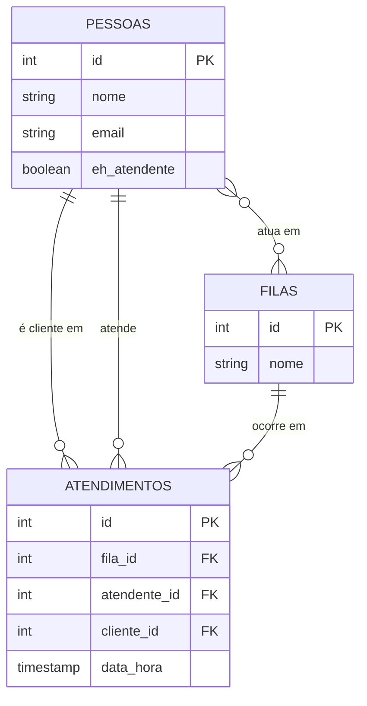

# Banco-de-Dados-sistema-atendimento-db
# Sistema de Atendimento

## Objetivo
Sistema para gerenciar o fluxo de atendimento de uma empresa, controlando
filas, atendentes e clientes atendidos.

## Público-alvo
Pequenas e médias empresas que precisam organizar filas de atendimento
(ex: suporte técnico, recepção, call center).

