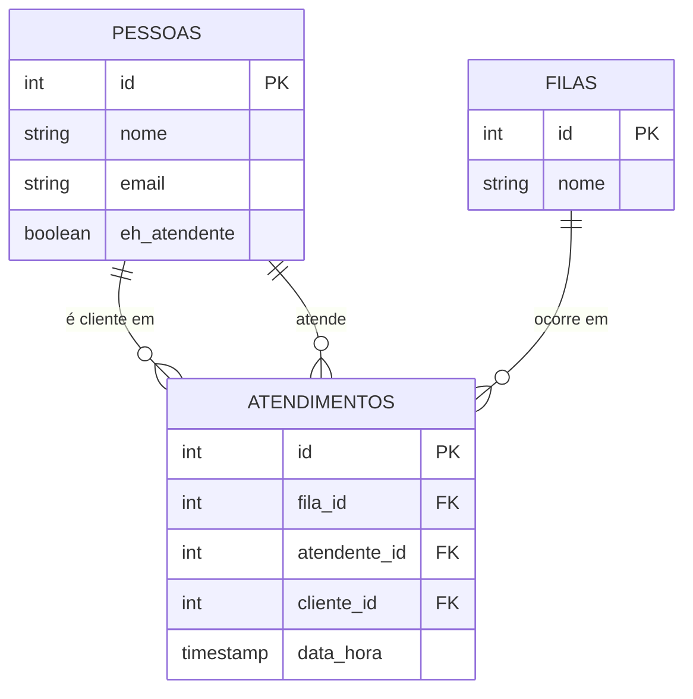

# Sistema de Atendimento

## Objetivo
Sistema para gerenciar o fluxo de atendimento de uma empresa, controlando
filas, atendentes e clientes atendidos.

## Público-alvo
Pequenas e médias empresas que precisam organizar filas de atendimento
(ex: suporte técnico, recepção, call center).

## Modelo de Dados

## Scripts

Os scripts SQL estão organizados na pasta `scripts/`:
- `create_table_*.sql` — criação das tabelas (DDL)
- `insert_into_*.sql` — inserção de dados de exemplo (DML)

## Validação de integridade

Foi testado que o comando `DELETE` em uma pessoa referenciada em `atendimentos`
é bloqueado pelo PostgreSQL, respeitando a chave estrangeira (FK) e garantindo
a integridade referencial do banco.